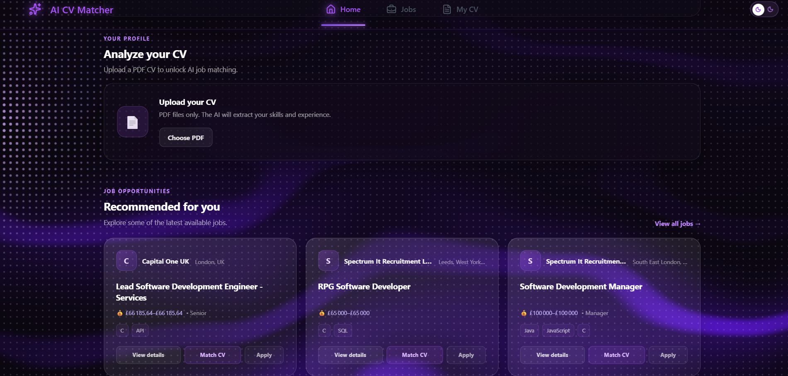
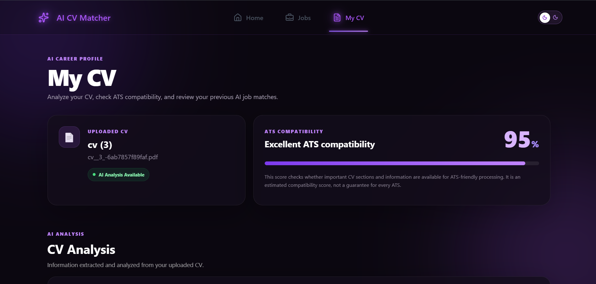
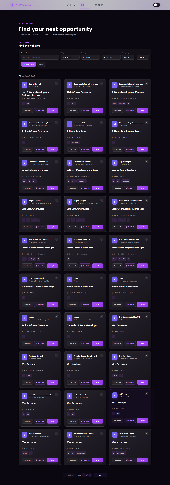
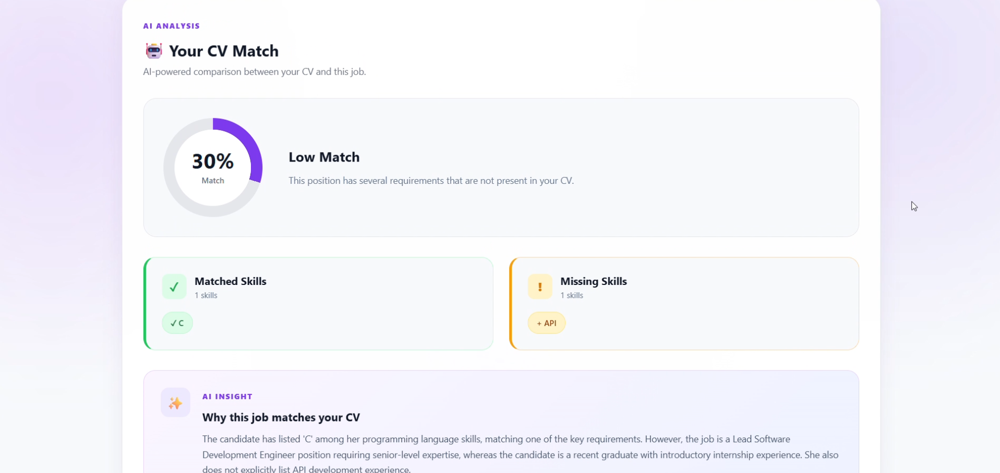

# AI CV Analyzer & Job Matcher

An AI-powered web application that analyzes CVs, extracts structured candidate information, searches for job opportunities, and evaluates how well a CV matches a selected job.

The project combines a **React frontend**, **Symfony backend**, **PostgreSQL database**, and **Google Gemini AI** to provide an end-to-end CV analysis and job-matching experience.

---

## 🚀 Live Demo

### Frontend

https://ai-cv-analyzer-blush.vercel.app/

### Backend API

https://ai-cv-analyzer-736q.onrender.com

> The backend is a REST API. Its root URL is not a traditional web page, so a `404` response at the root is not an indication that the API is unavailable.

---

## 📌 About the Project

Finding suitable job opportunities can be difficult because job seekers need to compare their skills, education, and experience with many different job descriptions.

**AI CV Analyzer & Job Matcher** simplifies this process by combining CV processing, artificial intelligence, and job search functionality in a single web application.

The application allows users to:

1. Upload a CV.
2. Analyze the CV using Gemini AI.
3. Extract structured candidate information.
4. Browse job opportunities.
5. Search and filter jobs.
6. View detailed job information.
7. Match a CV with a selected job.
8. Receive a compatibility score.
9. View matched and missing skills.
10. Read an explanation of the matching result.
11. Open the original job application page.

No account is required for the CV analysis and job-matching workflow.

---

## ✨ Features

### 📄 CV Upload

Users can upload their CV directly through the application.

The backend receives the document and processes its content before sending the extracted information to the AI analysis service.

### 🤖 AI CV Analysis

Gemini AI analyzes the CV and extracts structured information including:

* Name
* Email
* Phone
* Professional summary
* Skills
* Experience
* Education
* Languages
* Certifications

### 🔎 Job Search

Users can browse available job opportunities and search through the job database.

The application supports:

* Job search
* Job details
* Salary filtering
* Category filtering
* Country/location filtering
* Job recommendations

### 🧠 AI Job Matching

Users can select a job and compare it with their analyzed CV.

The matching result provides:

* Match score
* Matched skills
* Missing skills
* Explanation of the result

### 📊 Match Score

The application generates a percentage-based compatibility score to show how closely the candidate profile corresponds to the selected job.

### 🌍 International Jobs

The application contains job opportunities from multiple countries and regions.

### 🔗 Apply to Jobs

Users can open the original job source and continue the application process externally.

### 🌓 Dark / Light Mode

The frontend supports both dark and light themes.

### 🌐 Production Deployment

The application is deployed using:

* Vercel for the React frontend
* Render for the Symfony backend
* PostgreSQL for the production database

---

## 🧠 AI CV Analysis

The CV analysis process follows this workflow:

User uploads CV
       │
       ▼
React Frontend
       │
       │ HTTP POST
       ▼
Symfony Backend
       │
       ▼
CV File Processing
       │
       ▼
PDF Text Extraction
       │
       │ CV Text
       ▼
Gemini API
       │
       │ Structured JSON
       ▼
Symfony Processing
       │
       ▼
PostgreSQL
       │
       ▼
React Frontend
       │
       ▼
CV Analysis Results

The backend sends the extracted CV content to Gemini with instructions to return structured information.

The AI response is expected to contain fields such as:

name
email
phone
summary
skills
experience
education
languages
certifications

The application also includes retry and fallback handling for temporary Gemini API availability problems.

---

## 🎯 AI Job Matching

The job-matching process follows this workflow:

┌───────────────┐
│ Analyzed CV   │
└───────┬───────┘
        │
        │ CV ID
        ▼
┌───────────────┐
│   React UI    │
└───────┬───────┘
        │
        │ CV ID + Job ID
        ▼
┌────────────────────┐
│ POST /api/job-match│
└─────────┬──────────┘
          │
          ▼
┌────────────────────┐
│ Symfony Backend    │
└─────────┬──────────┘
          │
          ▼
┌────────────────────┐
│ CV + Job Data      │
└─────────┬──────────┘
          │
          ▼
┌────────────────────┐
│ Matching Analysis  │
└─────────┬──────────┘
          │
     ┌────┼────┐
     ▼    ▼    ▼
   Score Matched Missing
         Skills  Skills
          │
          ▼
┌────────────────────┐
│ React Match Result │
└────────────────────┘

The result helps users understand the relationship between their profile and the requirements of the selected job.

---

## 🏗️ Architecture

The application follows a client-server architecture with separate frontend, backend, database, and AI services.

                    ┌─────────────────────┐
                    │        USER         │
                    │                     │
                    │ Upload CV           │
                    │ Search Jobs         │
                    │ Match CV            │
                    │ Apply to Jobs       │
                    └──────────┬──────────┘
                               │
                               │ HTTPS
                               ▼
                    ┌─────────────────────┐
                    │       VERCEL        │
                    │                     │
                    │   React Frontend    │
                    │       + Vite        │
                    └──────────┬──────────┘
                               │
                               │ REST API
                               ▼
                    ┌─────────────────────┐
                    │       RENDER        │
                    │                     │
                    │  Symfony Backend    │
                    │      PHP 8.1        │
                    └─────────┬─┬─────────┘
                              │ │
                 ┌────────────┘ └────────────┐
                 │                           │
                 ▼                           ▼
      ┌─────────────────────┐     ┌─────────────────────┐
      │     PostgreSQL      │     │     Gemini API      │
      │                     │     │                     │
      │ CV                  │     │ AI CV Analysis      │
      │ Jobs                │     │ AI Processing       │
      │ Job Matches         │     │ Matching Analysis   │
      │ Users               │     │                     │
      └─────────────────────┘     └─────────────────────┘

### Frontend Layer

The React frontend is responsible for:

* User interface
* CV upload
* CV analysis display
* Job search
* Job filtering
* Job details
* Job matching interface
* Match result display
* Dark/light theme

### Backend Layer

The Symfony backend is responsible for:

* REST API
* CV upload processing
* PDF text extraction
* Gemini integration
* Job management
* Job search
* Job matching
* Database communication
* CORS configuration

### Database Layer

PostgreSQL provides persistent storage for application data.

Main entities include:

* User
* CV
* Job
* JobMatch

CV records can also exist without an authenticated user because the current application supports anonymous CV analysis and matching.

### AI Layer

Google Gemini provides AI-powered processing for CV analysis and job-matching functionality.


## 🔐 Security Architecture

Sensitive information is kept on the backend and is provided through environment variables.

                    React Frontend
                          │
                          │ API Requests
                          ▼
                    Symfony Backend
                          │
             ┌────────────┴────────────┐
             │                         │
             ▼                         ▼
       PostgreSQL                 Gemini API
                                      │
                                      │ API Key
                                      ▼
                             Environment Variable

The following sensitive values are not stored directly in the source code:

DATABASE_URL
GEMINI_API_KEY
ADZUNA_APP_ID
ADZUNA_APP_KEY

Environment files are excluded from Git using `.gitignore`.

---

## 🔄 Main Application Flow

                         ┌──────────┐
                         │   User   │
                         └────┬─────┘
                              │
                              ▼
                     ┌────────────────┐
                     │ React Frontend │
                     └───────┬────────┘
                             │
                  ┌──────────┴──────────┐
                  │                     │
                  ▼                     ▼
             Upload CV              Browse Jobs
                  │                     │
                  ▼                     ▼
             Symfony API           Symfony API
                  │                     │
                  ▼                     ▼
             PDF Parsing           PostgreSQL
                  │                     │
                  ▼                     │
             Gemini AI                  │
                  │                     │
                  ▼                     │
             CV Analysis               │
                  │                     │
                  └──────────┬──────────┘
                             ▼
                       Select a Job
                             │
                             ▼
                     Job Matching API
                             │
                             ▼
                       Match Result
                             │
             ┌───────────────┼───────────────┐
             ▼               ▼               ▼
          Score        Matched Skills   Missing Skills
                             │
                             ▼
                      React Frontend

---

## 🛠️ Technologies

### Frontend

* React
* Vite
* JavaScript
* CSS
* React Router

### Backend

* PHP
* Symfony 6.4 LTS
* Doctrine ORM
* API Platform
* Symfony HTTP Client

### Database

* PostgreSQL

### Artificial Intelligence

* Google Gemini API

### Deployment

* Vercel
* Render
* GitHub

### Development Tools

* Laragon
* Git
* GitHub
* Visual Studio Code

---

## 📂 Project Structure

ai-cv-analyzer/
│
├── backend/
│   ├── config/
│   ├── migrations/
│   ├── public/
│   ├── src/
│   │   ├── Controller/
│   │   ├── Entity/
│   │   ├── Repository/
│   │   └── Service/
│   ├── templates/
│   ├── composer.json
│   └── Dockerfile
│
├── frontend/
│   ├── public/
│   ├── src/
│   │   ├── api/
│   │   ├── components/
│   │   ├── pages/
│   │   ├── services/
│   │   └── ...
│   ├── package.json
│   └── vite.config.js
│
├── .gitignore
└── README.md

---

## ⚙️ Installation

### Prerequisites

Install the following tools:

* PHP 8.1 or higher
* Composer
* Node.js
* npm
* PostgreSQL
* Git

---

## 🔧 Backend Installation

Navigate to the backend:

powershell
cd backend


Install dependencies:

powershell
composer install


Configure your environment variables in:

backend/.env

Run database migrations:

powershell
php bin/console doctrine:migrations:migrate


Start the local backend:

powershell
php -S 127.0.0.1:8000 -t public


The local API will be available at:

http://127.0.0.1:8000

---

## 🎨 Frontend Installation

Navigate to the frontend:

```powershell
cd frontend
```

Install dependencies:

```powershell
npm install
```

Start the development server:

```powershell
npm run dev


The frontend will normally be available at:

http://localhost:5173


## 🔐 Environment Variables

Create/configure the backend environment variables:

dotenv
DATABASE_URL=
GEMINI_API_KEY=
ADZUNA_APP_ID=
ADZUNA_APP_KEY=

Do not commit real credentials to GitHub.

The `.env` file should remain local or be configured through the deployment platform's environment-variable settings.

---

## 🔌 API Endpoints

### Jobs

```http
GET /api/jobs
```

Returns available jobs.

```http
GET /api/jobs/{id}
```

Returns details for a specific job.

```http
GET /api/jobs/salary-options
```

Returns salary-related filtering options.

### CV

```http
POST /api/cv/upload
```

Uploads and processes a CV.

### Job Matching

```http
POST /api/job-match
```

Matches a CV with a selected job.

Example request:

```json
{
  "cvId": 1,
  "jobId": 1
}
```

Example response:

```json
{
  "score": 70,
  "matchedSkills": [
    "PHP",
    "Symfony",
    "MySQL"
  ],
  "missingSkills": [
    "Doctrine",
    "REST API"
  ],
  "explanation": "The candidate has several relevant technical skills..."
}
```

---

## 🗄️ Database

The application uses PostgreSQL for persistent data storage.

The main entities are:

User
 │
 └── CV
      │
      └── JobMatch
             │
             └── Job

Job
 │
 └── JobMatch

The current application supports anonymous CV processing, so a CV does not necessarily require an authenticated user.

---

## 📥 Job Data

The application includes a job-import process that retrieves job opportunities from external job data sources.

Imported job information can include:

* External job ID
* Job title
* Company
* Description
* Location
* Country
* Category
* Skills
* Salary
* Application/source URL
* Creation date

---

## 🚀 Deployment

### Frontend — Vercel

The React frontend is deployed on Vercel.

Production URL:

https://ai-cv-analyzer-blush.vercel.app/

### Backend — Render

The Symfony backend is deployed on Render.

Production API:

https://ai-cv-analyzer-736q.onrender.com

### Database

The production backend uses PostgreSQL.

### Source Control

The project source code is managed with Git and GitHub.

---

## 📸 Screenshots

Screenshots can be added to demonstrate the main features of the application.

Recommended screenshots:

1. Dashboard
2. CV upload
3. AI CV analysis
4. Jobs page
5. Job details
6. CV/job matching result
7. Dark mode
8. Light mode

Example:

## 📸 Screenshots

### Dashboard



### AI CV Analysis



### Jobs



### Job Matching


```

---

## 🔮 Future Improvements

Possible future improvements include:

* More advanced CV parsing
* Support for additional CV formats
* Improved AI matching
* Personalized job recommendations
* Saved jobs
* Application tracking
* CV optimization
* Cover letter generation
* Detailed candidate-job analytics
* Additional job data sources
* AI-powered CV improvement suggestions

---

## 🎓 Project Objectives

The main objectives of the project are to:

* Apply artificial intelligence to CV analysis.
* Automatically extract structured candidate information.
* Help users discover relevant employment opportunities.
* Compare candidate skills with job requirements.
* Provide understandable matching results.
* Develop a complete full-stack web application.
* Practice REST API development.
* Work with relational databases.
* Integrate an external AI service.
* Deploy a production application using cloud platforms.

---

## 👩‍💻 Author

**Aïcha Lassoued**

Information Technology — Information Systems Development

This project demonstrates practical experience in:

* Full-stack web development
* React
* Symfony
* PHP
* REST APIs
* PostgreSQL
* Artificial intelligence integration
* Cloud deployment
* Git/GitHub

---

## 📄 License

This project is intended primarily as a portfolio project.
