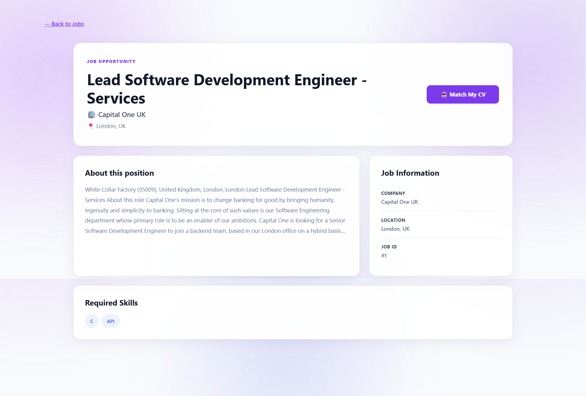

# AI CV Analyzer & Job Matcher

An AI-powered web application that analyzes CVs, extracts structured candidate information, searches for job opportunities, and evaluates how well a CV matches a selected job.

The project combines a **React frontend**, **Symfony backend**, **PostgreSQL database**, and **Google Gemini AI** to provide an end-to-end CV analysis and job-matching experience.

---

## 🚀 Live Demo

### 🌐 Web Application

**AI CV Analyzer & Job Matcher**

https://ai-cv-analyzer-blush.vercel.app/

The web application allows users to:

* Upload and analyze a CV using AI
* View structured CV information
* Search and filter job opportunities
* View job details
* Match an analyzed CV with a selected job
* View the matching score, matched skills, missing skills, and explanation

### 🔗 Backend API

https://ai-cv-analyzer-736q.onrender.com

The backend provides the REST API used by the React frontend.

> The backend root URL is an API endpoint rather than a traditional web page. Therefore, a `404` response when opening the root URL directly does not necessarily indicate that the backend is unavailable.

### 💻 Source Code

The complete source code is available on GitHub:

https://github.com/aicha04-dev/ai-cv-analyzer

The repository contains both the Symfony backend and React frontend.

---

## 📌 About the Project

Finding suitable job opportunities can be difficult because job seekers need to compare their skills, education, and experience with many different job descriptions.

**AI CV Analyzer & Job Matcher** simplifies this process by combining CV processing, artificial intelligence, and job search functionality in a single web application.

The application allows users to:

1. Upload a CV.
2. Analyze the CV using Gemini AI.
3. Extract structured candidate information.
4. Browse job opportunities.
5. Search and filter jobs.
6. View detailed job information.
7. Match a CV with a selected job.
8. Receive a compatibility score.
9. View matched and missing skills.
10. Read an explanation of the matching result.

No account is required for the CV analysis and job-matching workflow.

---

## ✨ Features

### 📄 CV Upload

Users can upload their CV directly through the application.

The backend receives the document, processes its content, and prepares the extracted information for AI analysis.

### 🤖 AI-Powered CV Analysis

Gemini AI analyzes the extracted CV content and returns structured candidate information, including:

* Name
* Email
* Phone
* Professional summary
* Skills
* Experience
* Education
* Languages
* Certifications

### 🔎 Job Search

Users can browse available job opportunities and search through the job database.

The application supports:

* Job search
* Job details
* Salary filtering
* Category filtering
* Country/location filtering
* Job recommendations

### 🧠 AI Job Matching

Users can select a job and compare it with their analyzed CV.

The matching result provides:

* Match score
* Matched skills
* Missing skills
* Explanation of the result

### 📊 Match Score

The application generates a percentage-based compatibility score that represents how closely the candidate profile corresponds to the selected job.

### 🌍 International Jobs

The application contains job opportunities from multiple countries and regions.

### 🌓 Dark / Light Mode

The frontend supports both dark and light themes.

### 👤 Anonymous CV Analysis

Users can analyze and match CVs without creating an account or signing in.

### 🌐 Production Deployment

The application is deployed using:

* Vercel for the React frontend
* Render for the Symfony backend
* PostgreSQL for the production database

---

## 🧠 AI CV Analysis

The CV analysis process follows this workflow:

```text
┌───────────────┐
│     User      │
│               │
│   Upload CV   │
└───────┬───────┘
        │
        ▼
┌────────────────────┐
│  React Frontend    │
└─────────┬──────────┘
          │
          │ HTTP POST
          ▼
┌────────────────────┐
│  Symfony Backend   │
└─────────┬──────────┘
          │
          ▼
┌────────────────────┐
│  CV File Processing│
└─────────┬──────────┘
          │
          ▼
┌────────────────────┐
│ PDF Text Extraction│
└─────────┬──────────┘
          │
          │ CV Text
          ▼
┌────────────────────┐
│     Gemini API     │
└─────────┬──────────┘
          │
          │ Structured JSON
          ▼
┌────────────────────┐
│ Symfony Processing │
└─────────┬──────────┘
          │
          ▼
┌────────────────────┐
│     PostgreSQL     │
└─────────┬──────────┘
          │
          ▼
┌────────────────────┐
│  React Frontend    │
└─────────┬──────────┘
          │
          ▼
┌────────────────────┐
│ CV Analysis Result │
└────────────────────┘
```

The backend extracts text from the uploaded CV and sends the relevant CV content to Gemini for structured analysis.

The AI response is expected to contain fields such as:

```text
name
email
phone
summary
skills
experience
education
languages
certifications
```

The backend then processes the AI response before returning the analysis results to the frontend.

The application also includes retry and fallback handling for temporary Gemini API availability problems.

---

## 🎯 AI Job Matching

The job-matching process follows this workflow:

```text
┌─────────────────┐
│   Analyzed CV   │
└────────┬────────┘
         │
         │ CV ID
         ▼
┌─────────────────┐
│    React UI     │
└────────┬────────┘
         │
         │ CV ID + Job ID
         ▼
┌─────────────────────┐
│ POST /api/job-match │
└──────────┬──────────┘
           │
           ▼
┌─────────────────────┐
│  Symfony Backend    │
└──────────┬──────────┘
           │
           ▼
┌─────────────────────┐
│    CV + Job Data    │
└──────────┬──────────┘
           │
           ▼
┌─────────────────────┐
│  Matching Analysis  │
└──────────┬──────────┘
           │
      ┌────┼─────┐
      ▼    ▼     ▼
    Score Matched Missing
          Skills  Skills
           │
           ▼
┌─────────────────────┐
│ React Match Result  │
└─────────────────────┘
```

The matching result helps users understand the relationship between their profile and the requirements of the selected job.

---

## 🏗️ Architecture

The application follows a client-server architecture with separate frontend, backend, database, and AI services.

```text
                    ┌─────────────────────┐
                    │        USER         │
                    │                     │
                    │ Upload CV           │
                    │ Search Jobs         │
                    │ Match CV            │
                    └──────────┬──────────┘
                               │
                               │ HTTPS
                               ▼
                    ┌─────────────────────┐
                    │       VERCEL        │
                    │                     │
                    │   React Frontend    │
                    │       + Vite        │
                    └──────────┬──────────┘
                               │
                               │ REST API
                               ▼
                    ┌─────────────────────┐
                    │       RENDER        │
                    │                     │
                    │  Symfony Backend    │
                    │      PHP 8.1        │
                    └─────────┬─┬─────────┘
                              │ │
                ┌─────────────┘ └─────────────┐
                │                             │
                ▼                             ▼
      ┌─────────────────────┐       ┌─────────────────────┐
      │     PostgreSQL      │       │     Gemini API      │
      │                     │       │                     │
      │ CV                  │       │ AI CV Analysis      │
      │ Jobs                │       │ AI Processing       │
      │ Job Matches         │       │ Matching Analysis   │
      │ Users               │       │                     │
      └─────────────────────┘       └─────────────────────┘
```

### Frontend Layer

The React frontend is responsible for:

* User interface
* CV upload
* CV analysis display
* Job search
* Job filtering
* Job details
* Job matching interface
* Match result display
* Dark/light theme

### Backend Layer

The Symfony backend is responsible for:

* REST API
* CV upload processing
* PDF text extraction
* Gemini integration
* Job management
* Job search
* Job matching
* Database communication
* CORS configuration

### Database Layer

PostgreSQL provides persistent storage for application data.

Main entities include:

* User
* CV
* Job
* JobMatch

CV records can also exist without an authenticated user because the current application supports anonymous CV analysis and matching.

### AI Layer

Google Gemini provides AI-powered processing for CV analysis and job-matching functionality.

---

## 🔐 Security Architecture

Sensitive information is kept on the backend and provided through environment variables.

```text
                    React Frontend
                          │
                          │ API Requests
                          ▼
                    Symfony Backend
                          │
             ┌────────────┴────────────┐
             │                         │
             ▼                         ▼
        PostgreSQL                 Gemini API
                                      │
                                      │ API Key
                                      ▼
                              Environment Variable
```

The following sensitive values are not stored directly in the source code:

```text
DATABASE_URL
GEMINI_API_KEY
ADZUNA_APP_ID
ADZUNA_APP_KEY
```

Environment files are excluded from Git using `.gitignore`.

Real credentials should never be committed to GitHub.

---

## 🔄 Main Application Flow

```text
                         ┌──────────┐
                         │   User   │
                         └────┬─────┘
                              │
                              ▼
                       ┌───────────────┐
                       │ React Frontend│
                       └───────┬───────┘
                               │
                     ┌─────────┴─────────┐
                     │                   │
                     ▼                   ▼
                Upload CV           Browse Jobs
                     │                   │
                     ▼                   ▼
                Symfony API         Symfony API
                     │                   │
                     ▼                   ▼
                PDF Parsing        PostgreSQL
                     │
                     ▼
                  Gemini AI
                     │
                     ▼
                CV Analysis
                     │
                     └──────────┐
                                │
                                ▼
                          Select a Job
                                │
                                ▼
                       Job Matching API
                                │
                                ▼
                          Match Result
                                │
             ┌──────────────────┼──────────────────┐
             ▼                  ▼                  ▼
           Score          Matched Skills     Missing Skills
             │                  │                  │
             └──────────────────┼──────────────────┘
                                ▼
                         React Frontend
```

---

## 🛠️ Technologies

### Frontend

* React
* Vite
* JavaScript
* CSS
* React Router

### Backend

* PHP
* Symfony 6.4 LTS
* Doctrine ORM
* API Platform
* Symfony HTTP Client

### Database

* PostgreSQL

### Artificial Intelligence

* Google Gemini API

### Deployment

* Vercel
* Render
* GitHub

### Development Tools

* Laragon
* Git
* Visual Studio Code

---

## 📂 Project Structure

```text
ai-cv-analyzer/

│
├── backend/
│   ├── config/
│   ├── migrations/
│   ├── public/
│   ├── src/
│   │   ├── Controller/
│   │   ├── Entity/
│   │   ├── Repository/
│   │   └── Service/
│   ├── templates/
│   ├── composer.json
│   └── Dockerfile
│
├── frontend/
│   ├── public/
│   ├── src/
│   │   ├── api/
│   │   ├── components/
│   │   ├── pages/
│   │   ├── services/
│   │   └── ...
│   ├── package.json
│   └── vite.config.js
│
├── screenshots/
│   ├── dashboard.png
│   ├── cv-analysis.png
│   ├── jobs.png
│   ├── job-details.png
│   └── job-matching.png
│
├── .gitignore
└── README.md
```

---

## ⚙️ Installation

### Prerequisites

Install the following tools:

* PHP 8.1 or higher
* Composer
* Node.js
* npm
* PostgreSQL
* Git

---

## 🔧 Backend Installation

Navigate to the backend directory:

```powershell
cd D:\laragon\www\ai-cv-analyzer\backend
```

Install PHP dependencies:

```powershell
composer install
```

Configure the required environment variables in:

```text
backend/.env
```

Run database migrations:

```powershell
php bin/console doctrine:migrations:migrate
```

Start the local backend:

```powershell
php -S 127.0.0.1:8000 -t public
```

The local API will be available at:

```text
http://127.0.0.1:8000
```

---

## 🎨 Frontend Installation

Open another PowerShell terminal and navigate to the frontend:

```powershell
cd D:\laragon\www\ai-cv-analyzer\frontend
```

Install dependencies:

```powershell
npm install
```

Start the development server:

```powershell
npm run dev
```

The frontend will normally be available at:

```text
http://localhost:5173
```

---

## 🔐 Environment Variables

The backend requires environment variables for database access, AI integration, and job-data access.

Example:

```dotenv
DATABASE_URL=
GEMINI_API_KEY=
ADZUNA_APP_ID=
ADZUNA_APP_KEY=
```

Do not commit real credentials to GitHub.

The `.env` file should remain local or be configured through the deployment platform's environment-variable settings.

---

## 🔌 API Documentation

The backend exposes a REST API used by the React frontend for CV processing, job search, job details, filtering, and CV/job matching.

Production API:

```text
https://ai-cv-analyzer-736q.onrender.com
```

### API Overview

| Method | Endpoint                   | Description                              |
| ------ | -------------------------- | ---------------------------------------- |
| `GET`  | `/api/jobs`                | Retrieve available jobs                  |
| `GET`  | `/api/jobs/{id}`           | Retrieve details for a specific job      |
| `GET`  | `/api/jobs/salary-options` | Retrieve salary filtering options        |
| `POST` | `/api/cv/upload`           | Upload and analyze a CV                  |
| `POST` | `/api/job-match`           | Match an analyzed CV with a selected job |

---

### 💼 Jobs API

#### Get Jobs

```http
GET /api/jobs
```

Returns available job opportunities from the application's job database.

The endpoint is used by the React frontend to display the jobs page and support job search and filtering.

#### Get Job Details

```http
GET /api/jobs/{id}
```

Returns detailed information about a specific job.

Example:

```http
GET /api/jobs/1
```

The job information can include:

* Job title
* Company
* Description
* Location
* Country
* Category
* Skills
* Salary
* External application/source URL
* Creation date

#### Get Salary Options

```http
GET /api/jobs/salary-options
```

Returns salary-related options used by the frontend for salary filtering.

---

### 📄 CV API

#### Upload and Analyze a CV

```http
POST /api/cv/upload
```

Uploads a CV and starts the CV analysis workflow.

The request uses:

```text
Content-Type: multipart/form-data
```

The backend performs the following operations:

```text
CV Upload
    │
    ▼
File Processing
    │
    ▼
PDF Text Extraction
    │
    ▼
Gemini AI Analysis
    │
    ▼
Structured CV Information
    │
    ▼
Database Storage
    │
    ▼
API Response
```

The analysis can contain:

```text
name
email
phone
summary
skills
experience
education
languages
certifications
```

The CV analysis workflow does not require the user to create an account.

---

### 🧠 Job Matching API

#### Match CV With a Job

```http
POST /api/job-match
```

Compares an analyzed CV with a selected job.

Example request:

```json
{
  "cvId": 1,
  "jobId": 1
}
```

The backend retrieves the CV and job information and performs the matching analysis.

The result includes the compatibility score, matched skills, missing skills, and an explanation.

Example response:

```json
{
  "score": 70,
  "matchedSkills": [
    "PHP",
    "Symfony",
    "MySQL"
  ],
  "missingSkills": [
    "Doctrine",
    "REST API"
  ],
  "explanation": "The candidate has several relevant technical skills..."
}
```

### Response Fields

| Field           | Description                                          |
| --------------- | ---------------------------------------------------- |
| `score`         | Percentage-based compatibility score                 |
| `matchedSkills` | Skills identified as relevant to both the CV and job |
| `missingSkills` | Relevant job skills not identified in the CV         |
| `explanation`   | Explanation of the matching result                   |

---

### 🔄 Job Matching Flow

```text
React Frontend
      │
      │ POST /api/job-match
      │
      ▼
Symfony Controller
      │
      ├── Retrieve CV
      │
      ├── Retrieve Job
      │
      └── Perform Matching
              │
              ▼
        Matching Result
              │
      ┌───────┼────────┐
      ▼       ▼        ▼
    Score   Matched   Missing
            Skills    Skills
              │
              ▼
        React Frontend
```

---

### ⚠️ Error Handling

The API returns an appropriate HTTP error response when a request cannot be processed.

Possible situations include:

* Missing CV
* Missing job
* Invalid CV or job identifier
* Invalid request data
* Unsupported or invalid uploaded file
* CV text extraction failure
* Temporary AI service availability problems
* Server-side processing errors

The frontend displays relevant error information to the user when an API request fails.

---

### 🔐 API Security

Sensitive API credentials are not exposed to the React frontend.

The architecture keeps external service credentials on the Symfony backend:

```text
React Frontend
      │
      │ API Request
      ▼
Symfony Backend
      │
      ├── PostgreSQL
      │
      └── Gemini API
```

The following credentials are configured through backend environment variables:

```text
DATABASE_URL
GEMINI_API_KEY
ADZUNA_APP_ID
ADZUNA_APP_KEY
```

Real credentials are excluded from the Git repository.

---

### 🧪 Example API Workflow

A typical CV analysis and matching workflow is:

```text
Upload CV
    │
    ▼
POST /api/cv/upload
    │
    ▼
Receive analyzed CV
    │
    ▼
Browse jobs
    │
    ▼
GET /api/jobs
    │
    ▼
Select a job
    │
    ▼
GET /api/jobs/{id}
    │
    ▼
Match CV with job
    │
    ▼
POST /api/job-match
    │
    ▼
Receive:
- Score
- Matched skills
- Missing skills
- Explanation
```

This API architecture separates the frontend presentation layer from the backend business logic and external AI services.

---

## 🗄️ Database

The application uses PostgreSQL for persistent data storage.

The main entities are:

```text
User
 │
 └── CV
      │
      └── JobMatch
             │
             └── Job

Job
 │
 └── JobMatch
```

### Main Entities

#### User

Represents an application user when authentication is used.

#### CV

Stores information about uploaded CVs and their analysis data.

The current application supports anonymous CV processing, so a CV does not necessarily require an authenticated user.

#### Job

Stores job opportunities and information such as title, company, description, location, category, skills, salary, and external source information.

#### JobMatch

Represents a matching relationship between a CV and a selected job and supports the job-matching workflow.

---

## 📥 Job Data

The application includes a job-import process that retrieves job opportunities from external job-data sources.

Imported job information can include:

* External job ID
* Job title
* Company
* Description
* Location
* Country
* Category
* Skills
* Salary
* Application/source URL
* Creation date

The job database allows users to search and filter opportunities from multiple countries and regions.

---

## 🚀 Deployment

### Frontend — Vercel

The React frontend is deployed on Vercel.

Production URL:

```text
https://ai-cv-analyzer-blush.vercel.app/
```

### Backend — Render

The Symfony backend is deployed on Render.

Production API:

```text
https://ai-cv-analyzer-736q.onrender.com
```

### Database

The production backend uses PostgreSQL.

### Source Control

The project source code is managed using Git and GitHub.

---

## 📸 Screenshots

Screenshots demonstrate the main features of the application.

### Dashboard


### AI CV Analysis


### Jobs


### Job Details



### Job Matching


---

## 🔮 Future Improvements

Possible future improvements include:

* More advanced CV parsing
* Support for additional CV formats
* Improved AI matching
* Personalized job recommendations
* Saved jobs
* Application tracking
* CV optimization
* Cover letter generation
* Detailed candidate-job analytics
* Additional job data sources
* AI-powered CV improvement suggestions

---

## 🎓 Project Objectives

The main objectives of the project are to:

* Apply artificial intelligence to CV analysis
* Automatically extract structured candidate information
* Help users discover relevant employment opportunities
* Compare candidate skills with job requirements
* Provide understandable matching results
* Develop a complete full-stack web application
* Practice REST API development
* Work with relational databases
* Integrate an external AI service
* Deploy a production application using cloud platforms

---

## 👩‍💻 Author

**Aïcha Lassoued**

Information Technology — Information Systems Development

This project demonstrates practical experience in:

* Full-stack web development
* React
* Symfony
* PHP
* REST APIs
* PostgreSQL
* Artificial intelligence integration
* Cloud deployment
* Git/GitHub

---

## 📄 License

This project is intended primarily as a portfolio project.
